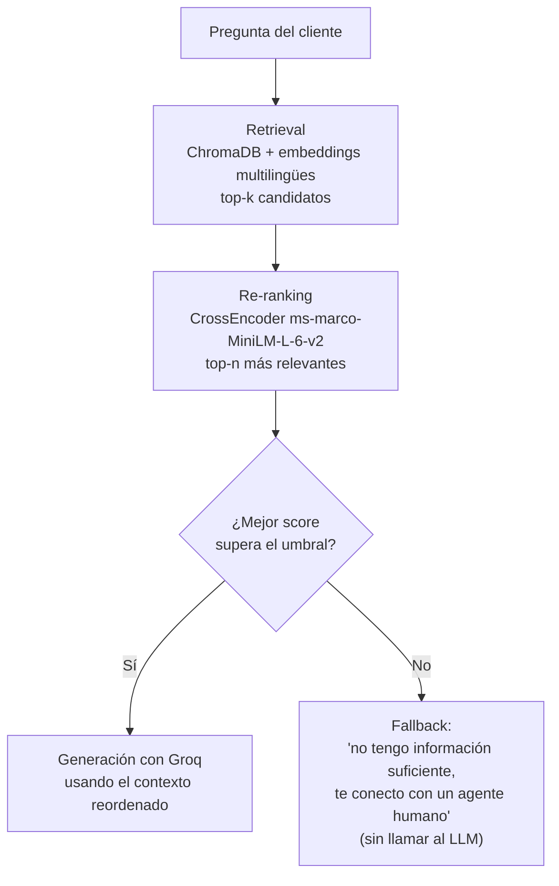

# Taller 2 — EcoMarket: Sistema RAG con Retrieval + Re-ranking

Continuación del [Taller 1](../taller%201%20genAI) (mismo caso EcoMarket),
pero en vez de inyectar los datos completos en el prompt, el asistente
ahora consulta una base de conocimiento real mediante un pipeline RAG de
dos etapas: **retrieval** (búsqueda por similitud vectorial) +
**re-ranking** (reordenamiento preciso con un cross-encoder) antes de
generar la respuesta.

Este es un proyecto **independiente** del Taller 1: tiene su propio
entorno virtual, dependencias y `.env`. No comparte código directamente,
aunque reutiliza sus mismos patrones (versionamiento de prompts, conexión
a Groq, manejo de UTF-8 en Windows).

| Fase | Entregable |
|---|---|
| 1 — Selección de componentes (embeddings + vector DB) | [`respuestas/fase1_seleccion_componentes.md`](./respuestas/fase1_seleccion_componentes.md) |
| 2 — Base de conocimiento (documentos + chunking) | [`respuestas/fase2_base_conocimiento.md`](./respuestas/fase2_base_conocimiento.md) |
| 3 — Integración y ejecución del código | código de este repositorio (`rag/`, `app_streamlit.py`) + [`respuestas/casos_de_prueba.md`](./respuestas/casos_de_prueba.md) |

## Arquitectura



Evidencia de que cada etapa funciona (casos reales, con scores) en
[`respuestas/casos_de_prueba.md`](./respuestas/casos_de_prueba.md).

## Estructura del repositorio

```
taller 2 genAI/
├── Taller 2.pdf
├── respuestas/
│   ├── fase1_seleccion_componentes.md    # Fase 1: embeddings + vector DB
│   ├── fase2_base_conocimiento.md        # Fase 2: documentos + chunking + indexación
│   └── casos_de_prueba.md                # Fase 3: casos de prueba con resultados esperados/obtenidos
├── knowledge_base/
│   ├── politica_devoluciones.md          # Reescritura en prosa de productos.json del Taller 1
│   ├── catalogo_productos.md             # Catálogo con precios (a partir de productos.json)
│   └── faq.md                            # Preguntas frecuentes (documento nuevo)
├── rag/
│   ├── ingest.py                         # Carga + chunking + embeddings + indexación en Chroma
│   ├── pipeline.py                       # Retrieval -> re-ranking -> generación (+ fallback)
│   ├── prompt_loader.py                  # Mismo patrón de versionamiento del Taller 1
│   └── prompts/
│       └── v1.toml                       # Prompt de generación del RAG
├── outputs/                              # Evidencia de corridas (se genera al probar la app o evaluate.py)
├── app_streamlit.py                      # UI: chat + toggle RAG on/off + panel de transparencia
├── requirements.txt
├── .env.example
└── chroma_db/                            # Índice vectorial persistido (se genera con rag/ingest.py, no se versiona)
```

## Cómo ejecutarlo

### 1. Instalar dependencias

```bash
python -m venv venv
venv\Scripts\activate          # Windows
pip install -r requirements.txt
```

### 2. Configurar la API key

Mismo proveedor que el Taller 1: [Groq](https://console.groq.com/keys)
(gratis, modelo open-source `openai/gpt-oss-20b`).

```bash
cp .env.example .env
```

```
GROQ_API_KEY="tu-api-key-de-groq"
GROQ_MODEL="openai/gpt-oss-20b"
```

### 3. Construir el índice vectorial

```bash
python -m rag.ingest
```

Esto lee `knowledge_base/*.md`, los segmenta en chunks, los convierte en
embeddings y los guarda en `chroma_db/`. Hay que volver a correrlo cada
vez que se edite algún documento de `knowledge_base/`.

### 4. Correr la app de Streamlit

```bash
streamlit run app_streamlit.py
```

La barra lateral permite:
- Activar/desactivar RAG (para comparar la respuesta con y sin retrieval,
  igual que la comparación v1/v2 del Taller 1).
- Ajustar cuántos chunks se recuperan (etapa 1) y cuántos sobreviven el
  re-ranking (etapa 2).
- Elegir la versión del prompt de generación.
- Ver, para cada respuesta, el panel de transparencia con los chunks
  recuperados y re-rankeados y sus scores.

## Componentes elegidos (resumen técnico)

| Componente | Elección | Por qué (detalle en Fase 1) |
|---|---|---|
| Embeddings | `sentence-transformers/paraphrase-multilingual-MiniLM-L12-v2` | Open-source, corre en CPU sin costo, soporta español |
| Base de datos vectorial | ChromaDB (persistido en disco) | Se integra nativo con LangChain, no requiere servicio externo de pago |
| Chunking | `RecursiveCharacterTextSplitter` (500 caracteres, 80 de overlap) | Respeta la estructura de los documentos (títulos, párrafos) antes de cortar por tamaño fijo |
| Re-ranking | `CrossEncoder` (`cross-encoder/ms-marco-MiniLM-L-6-v2`) | Reordena con mayor precisión los candidatos que trae la búsqueda vectorial |
| LLM de generación | Groq (`openai/gpt-oss-20b`) | Mismo modelo del Taller 1, continuidad y costo cero |

## Base de código de referencia

Este proyecto combina ideas de dos repos de referencia (carpetas hermanas
de este repositorio):
- `rag-tutorial-icesi`: pipeline de retrieval + re-ranking con FAISS y
  sentence-transformers (de aquí viene la idea del cross-encoder).
- `rag-chromadb-streamlit`: UI de chat en Streamlit sobre ChromaDB (de
  aquí viene la idea de la interfaz, simplificada para este taller: un
  solo chat con la knowledge base de EcoMarket ya cargada, sin
  persistencia multi-chat en SQLite).
